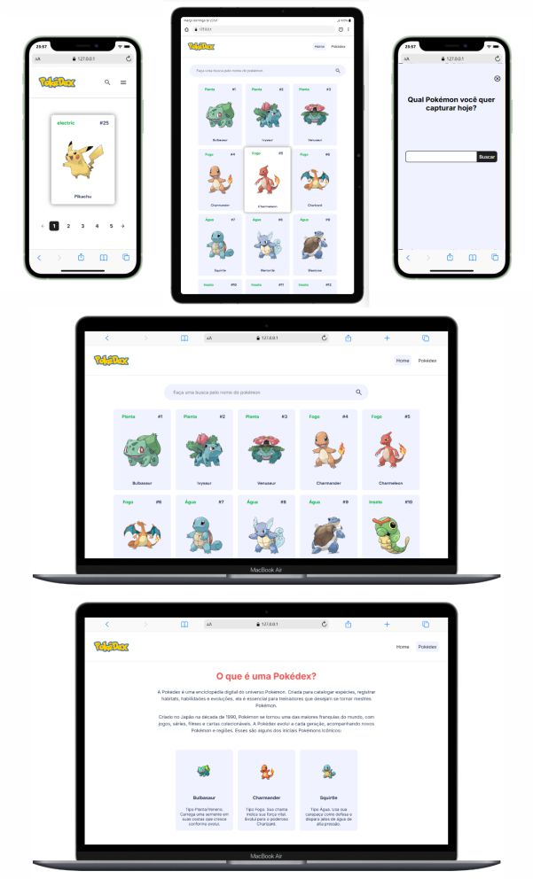

# ⚡ Projeto – PokéDex

## 📖 Sobre o Projeto

Este projeto foi desenvolvido utilizando tecnologias web modernas:

- 🌐 **HTML5**
- 🎨 **CSS3**
- ⚙️ **JavaScript (Vanilla)**

O objetivo é reproduzir a interface de um PokéDex com foco em:

- ✅ Semântica HTML5  
- ♿ Acessibilidade  
- 📱 Responsividade  
- ⚡ Performance  

---

## 🚀 Como Executar o Projeto

### 1️⃣ Clonar ou baixar o repositório

```bash
git clone https://github.com/Eds-FrontEnd/projeto-pokedex.git

Ou faça o download do arquivo `.zip`.

---

### 2️⃣ Executar com servidor local (Recomendado)

Abra o projeto no **Visual Studio Code** e execute um servidor local.

### ▶️ Opção Recomendada: Usando o Plugin Live Preview

Siga o passo a passo abaixo no Visual Studio Code:

1. Abra o **Visual Studio Code**
2. Clique em **Extensões** (ícone de blocos no menu lateral esquerdo)
3. Pesquise por **Live Preview** ou algum plugin de sua preferência
4. Instale a extensão **Live Preview (Microsoft)**
5. Após instalar, abra o arquivo `index.html`
6. Clique com o botão direito no arquivo
7. Selecione **"Show Preview"** ou **"Open with Live Preview"**
8. O servidor local será iniciado automaticamente
9. O projeto abrirá no navegador ou na aba interna do VS Code
10. Ou clique na opção "Open in Browser" no canto superior direito da janela do Live Preview (ícone de menu) para abrir o projeto diretamente no navegador.
---

⚠️ **Importante:**  
Não é recomendado abrir o arquivo `index.html` diretamente no navegador, pois funcionalidades como `fetch` e `modules (type="module")` podem não funcionar corretamente.

---

## 📱 Responsividade

O layout é totalmente adaptável para:

- 📲 Dispositivos móveis  
- 💻 Tablets  
- 🖥️ Desktop  

---

## ♿ Acessibilidade

- Uso de HTML semântico  
- Atributos `aria-*` quando necessário  
- Imagens com `alt` descritivo  
- Navegação funcional via teclado  

---

## 📸 Preview
### 🚀 Explore o projeto e divirta-se!



---
